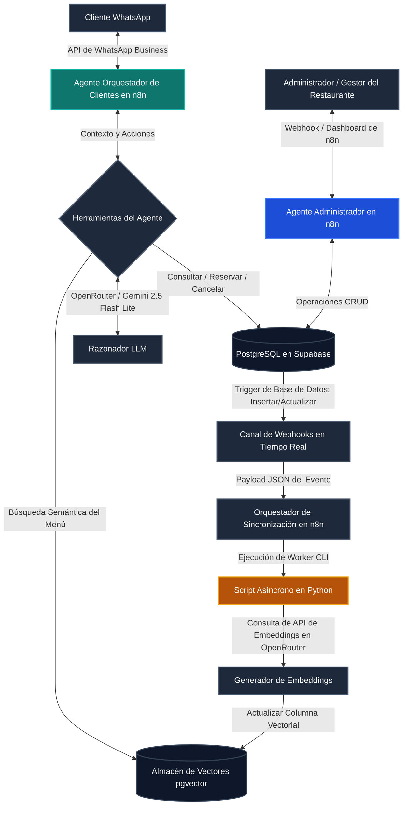

# 🍽️ TableFlow: Motor de Operaciones y Automatización para Restaurantes con IA a Nivel Empresarial

TableFlow es una plataforma de gestión operativa autónoma y lista para producción diseñada para restaurantes modernos. En lugar de ser un simple chatbot, TableFlow es un motor de flujos de trabajo altamente resiliente que automatiza la comunicación con los clientes, las reservas en tiempo real, la búsqueda semántica en el menú y la actualización del estado de la base de datos.

Al aprovechar **n8n** para la orquestación de flujos de trabajo empresariales, **PostgreSQL (con pgvector)** para la búsqueda semántica y un **pipeline asíncrono en Python para la sincronización de embeddings**, TableFlow mantiene los datos del menú y las representaciones de los agentes de IA perfectamente actualizados sin sobrecargar las APIs de producción.

---

## 📈 Arquitectura del Sistema

TableFlow utiliza una arquitectura desacoplada y dirigida por eventos para separar las operaciones costosas en segundo plano de las conversaciones en tiempo real con los clientes.



---

## 📂 Estructura de Directorios del Proyecto

El repositorio está estructurado como un paquete listo para ejecutar:

```text
TableFlow/
├── n8n/
│   └── tableflow-workflow.json           # Flujo de trabajo unificado de Agentes n8n para producción
├── python-services/
│   └── embedding-pipeline/
│       ├── embed_worker.py               # Script de Python para sondeo y actualización asíncrona de vectores
│       └── requirements.txt              # Requerimientos de librerías del script
├── docker-compose.yml                    # Configuración de n8n + ngrok para desarrollo local
├── .env.example                          # Plantilla de variables de entorno parametrizadas
└── README.md                             # Documentación técnica en español
```

---

## ⚙️ Diseño de los Agentes de IA Principales (Motor n8n)

TableFlow delega las operaciones a dos flujos de agentes especializados que corren dentro de un modelo unificado en **n8n** (`n8n/tableflow-workflow.json`), utilizando **Gemini 2.5 Flash Lite** y **GPT-4o-mini** (a través de **OpenRouter**) para un razonamiento veloz y rentable.

### 1. Agente Orquestador de Clientes (*Customer Orchestrator*)
Gestiona las interacciones con los clientes a través de WhatsApp para asegurar una experiencia fluida, rápida y natural, utilizando modismos y voseo argentino local.
*   **Consultas del Menú:** Realiza búsquedas vectoriales semánticas para responder preguntas específicas (ej. *¿Tienen algo bajo en carbohidratos por menos de $15 que no tenga maní?*).
*   **Ciclo de Vida de Reservas:** Verifica de forma autónoma la disponibilidad de mesas, crea reservas nuevas, permite a los usuarios consultar sus reservas activas y gestiona cancelaciones directamente en la base de datos de manera estructurada.
*   **Gestión del Contexto:** Mantiene la memoria del chat y un contexto conversacional persistente entre diferentes sesiones.

### 2. Agente Administrador (*Admin Agent*)
Permite al equipo de gestión del restaurante controlar el backend del negocio mediante lenguaje natural.
*   **Gestión Administrativa:** Crea, anula o reprograma reservas basándose en decisiones operativas directas de los managers.
*   **Modificaciones del Menú:** Modifica precios, disponibilidad de platos y perfiles de alérgenos directamente en PostgreSQL. Estas modificaciones se guardan con vector nulo, quedando encoladas automáticamente para su posterior vectorización.

---

## 🧠 Búsqueda Semántica de Alto Rendimiento y pgvector

En lugar de depender de búsquedas de texto plano tradicionales o escaneos manuales de la base de datos, TableFlow procesa el menú del restaurante como un **espacio vectorial multidimensional**.

1.  **Vectorización del Menú:** Los platos (nombre, descripción, ingredientes, clasificación y precio) se transforman en representaciones textuales estructuradas y luego se proyectan en el espacio vectorial.
2.  **Búsqueda por Similitud de Coseno:** Los mensajes de los usuarios se convierten en embeddings en tiempo real y se comparan contra la base de datos utilizando operadores de coseno de PostgreSQL (`<=>`):
    ```sql
    SELECT name, description, price 
    FROM menu 
    ORDER BY embedding <=> CURRENT_QUERY_EMBEDDING 
    LIMIT 3;
    ```
3.  **Inyección de Contexto:** Los 3 platos más cercanos en similitud semántica se recuperan y se inyectan en el prompt del *Agente Orquestador de Clientes*, asegurando respuestas 100% reales y sin alucinaciones.

---

## ⚡ Pipeline Asíncrono de Sincronización de Embeddings (Enfoque de Producción)

Un error común al diseñar proyectos de IA es generar los embeddings vectoriales de manera síncrona durante las llamadas a la API de conversación o en el momento exacto en que se edita la base de datos. Esto provoca latencias altas en las respuestas de cara al usuario, bloquea hilos de ejecución y puede provocar inconsistencias en los datos si la API externa falla.

### La Solución de TableFlow:
TableFlow desacopla las modificaciones de la base de datos de los cálculos matemáticos de vectores mediante un pipeline asíncrono y dirigido por eventos (`python-services/embedding-pipeline/embed_worker.py`):

1.  **Cambio de Estado:** El administrador actualiza una fila del menú (ej. cambia el precio de la *Ensalada Vegana*).
2.  **Estado de Vector Nulo:** La fila se guarda en PostgreSQL asignando `embedding = NULL`.
3.  **Sondeo de Script en Segundo Plano:** Un script en Python (`embed_worker.py`) consulta periódicamente las filas con vector nulo:
    ```sql
    SELECT id, nombre_plato, descripcion, precio, tiempo_preparacion, clasificacion, content
    FROM menu
    WHERE embedding IS NULL
    LIMIT 20;
    ```
4.  **Generación de Embedding:** Por cada fila sin vector, el script serializa sus campos, realiza una llamada a la API de OpenRouter (`openai/text-embedding-3-small`) para calcular el vector y lo escribe de vuelta en una transacción segura.
5.  **Cero Bloqueo de Interfaz:** El cliente que chatea por WhatsApp experiment en un tiempo de respuesta ultra bajo y constante, mientras que el menú del asistente de IA se sincroniza automáticamente en pocos segundos tras cualquier modificación administrativa.

---

## 🚀 Guía de Inicio Rápido (Despliegue Local)

### 1. Iniciar los Servicios de Infraestructura (Docker y ngrok)
TableFlow incluye una configuración lista en `docker-compose.yml` que levanta tanto `n8n` como un túnel de `ngrok` para exponer webhooks de manera segura mediante HTTPS.

1. Copia el archivo de plantilla a `.env`:
   ```bash
   cp .env.example .env
   ```
2. Completa los campos en `.env` con tus tokens de `NGROK_AUTHTOKEN`, `OPENROUTER_API_KEY` y `DATABASE_URL`.
3. Inicia los servicios en segundo plano:
   ```bash
   docker-compose up -d
   ```
4. Accede a tu panel local de n8n en `https://macaroni-owl-arise.ngrok-free.dev/` o en el puerto `5678`.

### 2. Configurar el Flujo en n8n
1. Abre el dashboard de tu n8n local.
2. Selecciona **Importar desde Archivo** y sube el flujo `n8n/tableflow-workflow.json`.
3. Configura tus credenciales para PostgreSQL, Supabase, OpenRouter y la API de WhatsApp Business.

### 3. Ejecutar el Script de Sincronización de Vectores
Para procesar y mantener actualizados los embeddings de los platos nuevos o modificados:
1. Dirígete a la carpeta del pipeline:
   ```bash
   cd python-services/embedding-pipeline
   ```
2. Instala las dependencias de Python necesarias:
   ```bash
   pip install -r requirements.txt
   ```
3. Ejecuta el script del worker:
   ```bash
   python embed_worker.py
   ```

---

## 💼 Valor de Negocio y Retorno de Inversión (ROI)

*   **Resiliencia Operativa:** Al delegar la gestión de reservas, cancelaciones y consultas repetitivas de la carta a agentes de IA autónomos, el personal del restaurante puede enfocarse exclusivamente en brindar una mejor atención física al cliente.
*   **Garantía contra Alucinaciones:** El aislamiento estricto de la base de conocimientos (mediante pgvector) impide que la IA invente platos inexistentes o precios desactualizados, protegiendo al restaurante ante problemas de alergias o reclamos comerciales.
*   **Costos Operativos Mínimos:** Al enrutar las llamadas del agente de clientes mediante Gemini 2.5 Flash Lite en OpenRouter, el costo de procesamiento por chat es de una milésima de centavo, haciendo el sistema extremadamente escalable y rentable.

---

## 🔮 Próximos Pasos y Roadmap

*   **Caché Semántico Avanzado:** Integrar una caché semántica basada en Redis para almacenar y responder consultas recurrentes de manera inmediata, reduciendo el consumo de APIs a cero para preguntas repetidas.
*   **Integración con Stripe:** Permitir pagos de señas de reservas o cuentas completas directamente a través de la interfaz de WhatsApp.
*   **Respuestas de Voz Interactivas (IVR):** Adaptar la lógica conversacional del agente para gestionar llamadas telefónicas mediante Twilio Voice con transcripción en tiempo real.
