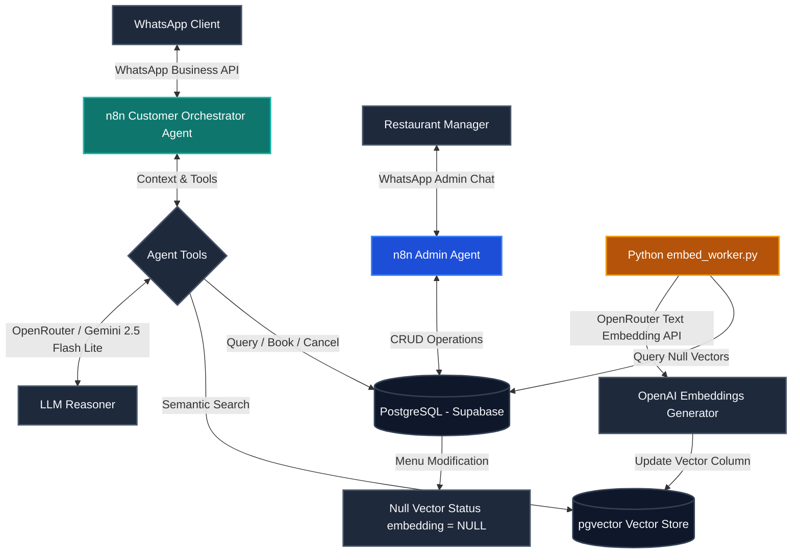
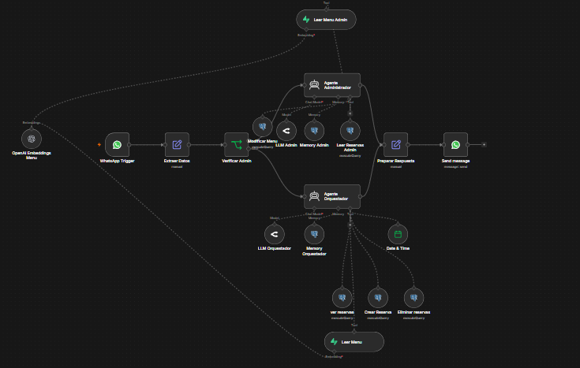

# 🍽️ TableFlow

### Autonomous AI-Powered Restaurant Assistant & Operational Automation Engine

[](https://n8n.io/)
[](https://www.postgresql.org/)
[](https://supabase.com/)
[](https://www.python.org/)
[](https://www.docker.com/)

TableFlow is a modular, production-ready backend engine that automates restaurant operations using AI agents and workflow orchestration. Instead of a simple chatbot, TableFlow functions as a reliable middleware that connects conversational interfaces (WhatsApp) with database systems (PostgreSQL/Supabase) to handle live customer reservations, semantic menu searches, and admin data mutations.

---

## 🛠️ What is TableFlow?

TableFlow bridges the gap between AI capabilities and actual business workflows by automating daily restaurant tasks. It acts as:
* **A WhatsApp Restaurant Assistant:** Managing real-time conversations with customers using local phrasing and context-aware responses.
* **A Reservation Orchestrator:** Validating table availability, creating reservations, and processing cancellations directly inside a relational database.
* **A Semantic Menu Search Engine:** Leveraging high-dimensional vector embeddings and similarity search to answer complex customer queries (e.g., *Is there a vegetarian option under $20 that doesn't contain nuts?*).
* **An Admin Operations Channel:** Allowing managers to modify menu descriptions, update prices, and reschedule bookings directly via natural language messages.

---

## 🚀 Core Features

* **Multi-Agent Orchestration:** Decoupled flow routing conversations to a **Customer Agent** or an **Admin Agent** based on sender authentication.
* **Semantic Menu Queries:** Utilizes `pgvector` for cosine similarity matching, injecting exact matched context to eliminate LLM hallucinations.
* **CRUD Database Operations:** Safe reservation creation, retrieval, and deletion directly into PostgreSQL.
* **Modular Integration Webhooks:** Exposed APIs handling incoming payloads from WhatsApp Business.
* **Structured Payload Normalization:** Custom data extraction and parsing of complex JSON webhooks using JavaScript and Python nodes.
* **Self-Hosted Infrastructure:** Designed to run in Docker environments with ngrok tunneling for local development and webhooks testing.

---

## 📊 System Architecture

TableFlow separates long-running/costly background tasks from real-time customer interactions to ensure low latency and high availability.



---

## 🤖 n8n Automation Pipeline

The n8n workflow operates as a unified state machine that routes and processes incoming customer and admin traffic.



### Workflow Breakdown:
1. **WhatsApp Trigger:** Receives the raw JSON webhook payload from the WhatsApp Business API.
2. **Extraer Datos (Data Extraction):** A helper node parses and normalizes the incoming JSON (extracting sender phone, name, and message text).
3. **Verificar Admin (Admin Verification):** A conditional switch node validates the sender's phone number against the authorized administrator credentials.
4. **Admin Agent Branch:** 
   * Activates the `Agente Administrador` node.
   * Equipped with tools to update menu details (`Modificar Menu`), read customer reservation logs (`Leer Reservas Admin`), and inspect current menu items (`Leer Menu Admin`).
5. **Customer Orchestrator Branch:** 
   * Activates the `Agente Orquestador` node.
   * Equipped with tools to verify bookings (`ver reservas`), create new reservations (`Crear Reserva`), cancel bookings (`Eliminar reservas`), and read menu details (`Leer Menu`) with integrated semantic search.
6. **Preparar Respuesta & Send Message:** Standardizes the output from both agents, formats the response text, and dispatches it back to the user via WhatsApp.

---

## ⚡ Embedding Synchronization Layer

The embedding generation and vector synchronization pipeline is **decoupled** from the main n8n conversational workflow. 

```
[ Menu Updated by Admin ] ──> [ Database Record Updated (embedding = NULL) ]
                                                   │
                                      (Executed manually / CRON)
                                                   ▼
[ pgvector Updated ] <── [ OpenAI Embeddings API ] <── [ Python embed_worker.py ]
```

### Decoupling Rationale
The synchronization worker (`python-services/embedding-pipeline/embed_worker.py`) runs as a separate Python script. When an administrator modifies a dish price or description, the record is updated in PostgreSQL, and its `embedding` column is set to `NULL`. 

Currently, the Python script must be executed manually to scan the database for null-vector rows, call the embedding API (`openai/text-embedding-3-small` via OpenRouter), and update the vectors in `pgvector`.

This architectural choice was made to:
* **Simplify Debugging:** Isolates conversational workflow logs from data ingestion pipelines.
* **Avoid Sync Blocks:** Keeps conversational response latency under 1.5 seconds by not blocking chats with API-based embedding generation.
* **Control API Cost:** Prevents unnecessary or redundant API calls during rapid menu edits.

While the design is fully prepared to be automated via Supabase Database Webhooks triggering n8n or an API endpoint, it currently operates as a semi-manual batch process.

---

## 📦 Tech Stack

* **Backend:** Python, JavaScript (Node.js)
* **Automation:** n8n (Advanced workflows & AI agents)
* **Database & Vectors:** PostgreSQL, Supabase, pgvector
* **AI/LLMs:** OpenRouter (Gemini 2.5 Flash Lite, GPT-4o-mini), OpenAI Embeddings API
* **Infrastructure:** Docker, Docker Compose, ngrok (local webhook exposure)

---

## 🎯 Repository Goals

This project represents a practical showcase of:
1. **Real-World Integration Architecture:** Connecting third-party chat APIs (WhatsApp) with database backends using workflows.
2. **AI Middleware Design:** Implementing decoupled pipelines to handle heavy calculations (vector embeddings) off-thread.
3. **Structured AI Tooling:** Restricting LLM scope via relational databases and semantic search, ensuring zero-hallucination business logic.

---

## 🔮 Future Improvements (Roadmap)

* [ ] **Automated Embedding Triggers:** Configure Supabase db triggers to automatically hit an n8n webhook and execute the Python embedding worker upon database mutations.
* [ ] **Admin Dashboard:** A lightweight web UI for manual reservation management and live vector database inspection.
* [ ] **System Logging & Monitoring:** Add workflow execution dashboards for tracking conversational metrics, token usage, and API latency.
* [ ] **Semantic Cache:** Integrate a Redis-based cache to answer repetitive client questions immediately, reducing LLM token costs to zero.
