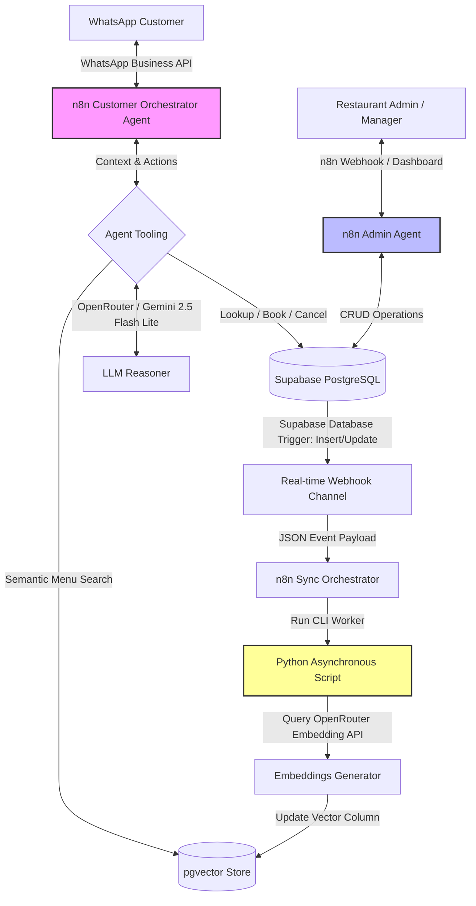

# 🍽️ TableFlow: Enterprise-Grade AI Restaurant Operations & Automation Engine

TableFlow is an autonomous, production-ready operational management platform designed for modern restaurants. Rather than a simple chatbot, TableFlow is a highly resilient workflow engine that automates customer communication, real-time reservations, intelligent menu search, and database state updates. 

By leveraging **n8n** for enterprise workflow orchestration, **PostgreSQL (with pgvector)** for semantic search, and an **asynchronous Python embedding synchronization pipeline**, TableFlow demonstrates a robust architecture that keeps menu data and AI-agent representations perfectly synchronized without bottlenecking production APIs.

---

## 📈 System Architecture

TableFlow utilizes a decoupled, event-driven architecture to split expensive background operations from real-time customer conversations.



---

## ⚙️ Core AI Agents Design

TableFlow delegates operations to two specialized agentic workflows running inside **n8n**, utilizing **Gemini 2.5 Flash Lite** (via **OpenRouter**) for high-speed, cost-effective reasoning.

### 1. Customer Orchestrator Agent
Orchestrates client-facing interactions over WhatsApp to ensure a human-like, efficient user experience.
*   **Menu Queries:** Uses semantic vector search to answer highly specific questions (e.g., *"Do you have anything low-carb under $15 that doesn't contain peanuts?"*).
*   **Reservation Lifecycle:** Autonomously verifies seating availability, creates new bookings, allows customers to look up active reservations, or process cancellations via structured database operations.
*   **Context Management:** Maintains chat memory and persistent conversational context across sessions.

### 2. Admin Agent
Empowers restaurant management with conversational backend control.
*   **Administrative Management:** Creates, overrides, or reschedules bookings based on manual restaurant overrides.
*   **Menu Modifications:** Handles on-the-fly updates to item pricing, availability, and allergen profiles directly into PostgreSQL, automatically queuing them for vector updates.

---

## 🛠️ Technology Stack

*   **Workflow Orchestration:** `n8n` (Self-hosted via Docker).
*   **Real-time Database & Backend:** `Supabase` / `PostgreSQL`.
*   **Semantic Vector Database:** `pgvector` extension for cosine similarity computations.
*   **Conversational Gateway:** `WhatsApp Business Cloud API`.
*   **Model Provider & AI Layer:** `OpenRouter` serving `Gemini 2.5 Flash Lite` (incorporating function-calling and tool routing).
*   **Data Pipeline Workers:** `Python 3.11` (utilizing lightweight operational wrappers for database connections).

---

## 🧠 High-Performance Semantic Search & pgvector

Rather than relying on basic string matching or raw database scans, TableFlow treats the restaurant menu as a **multi-dimensional vector space**.

1.  **Menu Vectorization:** Menu items (descriptions, ingredients, categorization, pricing) are serialized into structured textual records and projected into vector space.
2.  **Cosine Similarity Matching:** User prompts are embedded in real-time and queried against the database using PostgreSQL cosine operators (`<=>`):
    ```sql
    SELECT name, description, price 
    FROM menu 
    ORDER BY embedding <=> CURRENT_QUERY_EMBEDDING 
    LIMIT 3;
    ```
3.  **Context-Injection:** The top 3 closest items are retrieved and fed to the *Customer Orchestrator Agent* as grounding context, guaranteeing 100% factual responses.

---

## ⚡ Asynchronous Embedding Sync Pipeline (Production Thinking)

A common design flaw in AI projects is generating vector embeddings synchronously during conversational API requests or direct database writes. This causes high API latencies, locks threads, and risks out-of-sync vector records if an API call fails.

### The TableFlow Approach:
TableFlow decouples database modifications from vector mathematical computations using an event-driven sync pipeline:

1.  **State Change:** The manager updates a menu row (e.g., changing the price of the *Vegan Salad*).
2.  **Database Hook:** Supabase detects the row update and triggers an internal webhook with a JSON payload containing the old and new states.
3.  **Background n8n Orchestrator:** The n8n automation engine intercepts the webhook, parses the record, and schedules an independent **Python worker**.
4.  **Worker Execution:** The Python script generates the embedding asynchronously and writes the updated vector directly back to the database in a secure transaction.
5.  **Zero Interface Blocking:** The customer talking on WhatsApp experiences zero lag or latency, while the AI system's search capabilities update automatically within seconds of a database write.

---

## 💼 Business Value & Return on Investment (ROI)

*   **Operational Resilience:** By offloading booking, scheduling, and repetitive menu inquiries to autonomous agents, staff can focus on guest service.
*   **Hallucination Protection:** The strict separation of grounding contextual knowledge (via pgvector) prevents the AI from inventing non-existent dishes or incorrect pricing.
*   **Ultra-low Operational Overhead:** Leveraging Gemini 2.5 Flash Lite through OpenRouter keeps conversational costs to a fraction of a cent per session, providing immense scalability margins.

---

## 📂 Project Structure

```text
TableFlow/
├── n8n/
│   ├── customer-orchestrator-agent.json  # Workflow for WhatsApp & Customer interactions
│   ├── admin-agent.json                  # Workflow for administrative CRUD operations
│   └── database-triggers.json            # Event capture and background job trigger
├── python-services/
│   ├── embedding-pipeline/
│   │   ├── main.py                       # Main pipeline listener and executor
│   │   ├── generator.py                  # Core embedding mathematical calculations
│   │   ├── requirements.txt              # Standard package requirements
│   │   └── config.py                     # Database and API keys configurations
├── database/
│   ├── schema.sql                        # PostgreSQL schemas and pgvector index configurations
│   └── seed.sql                          # Testing and development seed data
├── docker-compose.yml                    # Local multi-container developer setup
└── README.md                             # Production documentation
```

---

## 🔮 Future Roadmap

*   **Advanced Semantic Caching:** Implement a Redis semantic cache to store and instantly serve identical vector queries, cutting API expenses to zero for common requests.
*   **Stripe Integration:** Allow customers to pay reservation deposits or settle tabs directly through the WhatsApp interface.
*   **Interactive Voice Responses (IVR):** Transition the conversational logic to handle direct phone calls using Twilio Voice and real-time transcription.

---

## 📸 Screenshots & Demonstrations

> [!NOTE]
> *Place screenshots of the WhatsApp conversational flow, the n8n agent canvases, and active Supabase database columns here to demonstrate operational execution.*
