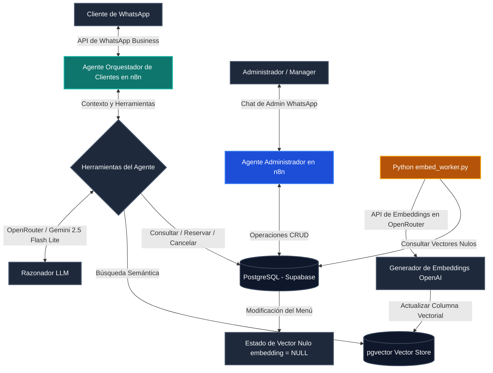

# 🍽️ TableFlow

### Asistente Autónomo para Restaurantes con IA & Motor de Automatización Operativa

[](https://n8n.io/)
[](https://www.postgresql.org/)
[](https://supabase.com/)
[](https://www.python.org/)
[](https://www.docker.com/)

TableFlow es un motor de backend modular y listo para producción que automatiza las operaciones de restaurantes utilizando agentes de IA y orquestación de flujos de trabajo. En lugar de ser un simple chatbot, TableFlow actúa como un middleware confiable que conecta interfaces conversacionales (WhatsApp) con sistemas de bases de datos (PostgreSQL/Supabase) para gestionar reservas de clientes en tiempo real, búsquedas semánticas del menú y mutación de datos por parte de administradores.

---

## 🛠️ ¿Qué es TableFlow?

TableFlow cierra la brecha entre las capacidades de la IA y los flujos de trabajo reales de un negocio, automatizando las tareas diarias de un restaurante:
* **Asistente de Restaurante en WhatsApp:** Gestiona conversaciones en tiempo real con clientes, utilizando respuestas contextuales y modismos locales.
* **Orquestador de Reservas:** Valida la disponibilidad de mesas, crea reservas y procesa cancelaciones directamente en la base de datos relacional.
* **Búsqueda Semántica del Menú:** Aprovecha embeddings vectoriales multidimensionales y búsqueda por similitud para responder consultas complejas de los clientes (ej. *¿Hay alguna opción vegetariana por menos de $20 que no tenga maní?*).
* **Canal de Operaciones de Administración:** Permite a los managers modificar descripciones del menú, actualizar precios y reorganizar reservas directamente usando mensajes en lenguaje natural.

---

## 🚀 Características Principales

* **Orquestación Multi-Agente:** Flujo desacoplado que enruta las conversaciones a un **Agente de Clientes** o a un **Agente Administrador** basándose en la autenticación del remitente.
* **Consultas de Menú Semánticas:** Utiliza `pgvector` para coincidencias de similitud de coseno, inyectando el contexto exacto en el prompt para eliminar al 100% las alucinaciones de los LLMs.
* **Operaciones CRUD en Base de Datos:** Creación, lectura y eliminación segura de reservas de forma directa en PostgreSQL.
* **Integración Webhook Modular:** APIs expuestas preparadas para recibir e interpretar los payloads de WhatsApp Business.
* **Normalización de Payloads Estructurados:** Extracción y formateo de datos complejos JSON mediante nodos de JavaScript y Python integrados en los workflows.
* **Infraestructura Autohospedada:** Diseñado para correr en entornos Docker con túneles de ngrok para desarrollo local y pruebas de webhooks.

---

## 📊 Arquitectura del Sistema

TableFlow separa las operaciones pesadas y costosas en segundo plano de las interacciones en tiempo real con el cliente para garantizar una latencia ultra baja y alta disponibilidad.



---

## 🤖 Pipeline de Automatización en n8n

El flujo de trabajo en n8n funciona como una máquina de estados unificada que enruta y procesa el tráfico entrante de clientes y administradores.


### Desglose del Flujo:
1. **WhatsApp Trigger:** Recibe el payload JSON en bruto enviado por la API de WhatsApp Business.
2. **Extraer Datos:** Un nodo de procesamiento limpia y normaliza el JSON (extrayendo el teléfono del remitente, su nombre y el mensaje de texto).
3. **Verificar Admin:** Un switch condicional valida si el número de teléfono pertenece a un administrador autorizado.
4. **Rama del Agente Administrador:**
   * Activa el nodo `Agente Administrador`.
   * Cuenta con herramientas para actualizar detalles del menú (`Modificar Menu`), revisar registros de reservas (`Leer Reservas Admin`) e inspeccionar los platos activos (`Leer Menu Admin`).
5. **Rama del Orquestador de Clientes:**
   * Activa el nodo `Agente Orquestador`.
   * Cuenta con herramientas para verificar reservas (`ver reservas`), crear nuevas reservas (`Crear Reserva`), cancelar reservas (`Eliminar reservas`) y leer la carta (`Leer Menu`) con búsqueda semántica integrada.
6. **Preparar Respuesta & Send Message:** Estandariza la salida del agente seleccionado, formatea el texto de respuesta y lo envía de vuelta al usuario vía WhatsApp.

---

## ⚡ Capa de Sincronización de Embeddings

La generación de embeddings y sincronización de vectores está **desacoplada** del flujo conversacional en tiempo real de n8n.

```
[ Menú Modificado por Admin ] ──> [ Registro en BD Actualizado (embedding = NULL) ]
                                                        │
                                          (Ejecución manual / CRON)
                                                        ▼
[ pgvector Actualizado ] <── [ API de Embeddings ] <── [ Python embed_worker.py ]
```

### Justificación de la Arquitectura Desacoplada
El worker de sincronización (`python-services/embedding-pipeline/embed_worker.py`) se ejecuta como un script de Python independiente. Cuando un administrador edita el precio o descripción de un plato, el registro correspondiente se actualiza en PostgreSQL y su columna `embedding` se setea en `NULL`.

Actualmente, el script de Python debe ser ejecutado manualmente para escanear la base de datos en busca de filas con vectores nulos, llamar a la API de embeddings (`openai/text-embedding-3-small` a través de OpenRouter) y actualizar los vectores correspondientes en `pgvector`.

Esta elección de diseño se tomó para:
* **Simplificar el Debugging:** Aísla por completo los logs conversacionales de los logs de la ingesta y vectorización de datos.
* **Evitar Bloqueos de Respuesta:** Mantiene la latencia conversacional del chat por debajo de los 1.5 segundos, al evitar llamadas síncronas a APIs de embeddings durante el chat.
* **Controlar Costos de API:** Evita llamadas redundantes o innecesarias a APIs de IA durante ediciones masivas del menú.

Aunque el diseño está preparado para automatizarse completamente en el futuro (ej. triggers de Supabase que disparen un webhook en n8n o un endpoint de API), actualmente funciona de forma semi-manual por lotes (batch).

---

## 📦 Stack Tecnológico

* **Backend:** Python, JavaScript (Node.js)
* **Automatización:** n8n (Workflows avanzados y Agentes de IA)
* **Bases de Datos & Vectores:** PostgreSQL, Supabase, pgvector
* **IA/LLMs:** OpenRouter (Gemini 2.5 Flash Lite, GPT-4o-mini), OpenAI Embeddings API
* **Infraestructura:** Docker, Docker Compose, ngrok (exposición local de webhooks)

---

## 🎯 Objetivos del Repositorio

Este proyecto representa una demostración práctica de:
1. **Arquitectura de Integración Real:** Conectar APIs de chat de terceros (WhatsApp) con backends de bases de datos mediante flujos lógicos.
2. **Diseño de Middleware de IA:** Implementación de pipelines desacoplados para derivar cálculos matemáticos costosos (embeddings) fuera del hilo de conversación principal.
3. **Uso Estructurado de Herramientas de IA:** Restringir el alcance y contexto del LLM a través de bases de datos relacionales y búsqueda semántica, garantizando lógica de negocio sin alucinaciones.

---

## 🔮 Próximas Mejoras (Roadmap)

* [ ] **Triggers Automáticos de Embeddings:** Configurar Database Webhooks en Supabase para llamar automáticamente a un webhook de n8n y ejecutar el script Python de vectorización tras cambios en el menú.
* [ ] **Dashboard de Administración:** Una interfaz web ligera para la gestión manual de reservas y la inspección en tiempo real de los vectores.
* [ ] **Monitoreo y Logging de Sistemas:** Añadir paneles para visualizar la ejecución de workflows, métricas de conversación, consumo de tokens y latencias de APIs.
* [ ] **Caché Semántica:** Integrar una caché basada en Redis para responder consultas repetitivas de forma inmediata y reducir costos de tokens de LLMs a cero para consultas frecuentes.
